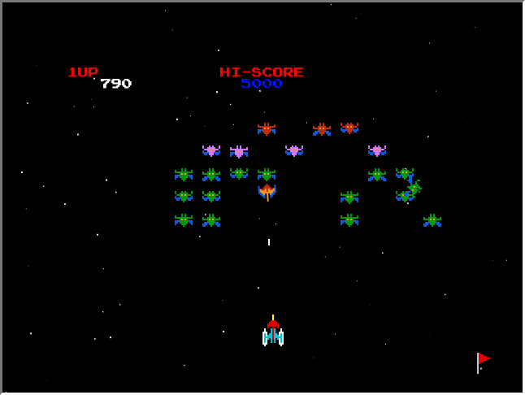

<div align="center">

# 👾 Galaxian HTML5

**A faithful browser remake of Namco's 1979 arcade classic, drawn pixel by pixel on a single `<canvas>`.**




</div>

---

## About

Galaxian HTML5 recreates the original Galaxian: the formation sways back and forth, aliens break away and dive at you, and you get one shot at a time. It's plain TypeScript and the Canvas 2D API, with no game engine and no framework. The game runs a fixed 60 Hz simulation on a 640×480 canvas, using the original sprite sheets and sounds.

## Features

- 🛸 **The full formation:** flagships, red escorts, purple emissaries and three rows of green drones, swaying side to side.
- 🌀 **Dive attacks:** aliens loop up and out of the formation, then swoop toward your ship and home in until the last moment.
- 💣 **Alien bombs:** divers drop bombs aimed at where you are, so you have to keep moving.
- 💥 **Collisions:** an alien that reaches your ship takes it down with it. If it misses, it wraps from the bottom of the screen and flies back to its slot.
- 🎯 **One shot at a time:** as in the arcade, you can't fire again until your bullet hits or leaves the screen.
- 🏆 **Persistent high score:** your best score is saved in `localStorage`.
- 🌌 **Parallax starfield:** stars fall at several speeds behind the action.
- 🔊 **Arcade sound:** effects play through [Howler.js](https://howlerjs.com/), with overlapping playback and mobile audio unlock.
- ⏸️ **Auto-pause:** the game pauses and goes silent when you switch tabs or windows. Press `Esc` to resume.
- ⏱️ **Smooth timing:** a `requestAnimationFrame` loop with a fixed timestep, so the game plays at the same speed on 60 Hz and 144 Hz displays.

## Controls

| Action        | Keys                 |
| ------------- | -------------------- |
| Move          | `←` `→` or `A` `D`   |
| Fire          | `Space`              |
| Menu up/down  | `↑` `↓` or `W` `S`   |
| Start         | `Enter`              |
| Pause         | `Esc`                |
| Mute          | `M`                  |

The same keys appear as a clickable legend under the game. Click or tap them to play with a mouse or on a touchscreen; you can hold the arrows to move. Pause and Mute light up while they're on.

## Getting started

Requires [Node.js](https://nodejs.org/) 20.19+ or 22.13+.

```sh
git clone git@github.com:Graidenix/galaxian-html5.git
cd galaxian-html5
npm install
npm run dev
```

Open the URL Vite prints, press **Enter**, and defend the galaxy.

### Scripts

| Command             | What it does                                 |
| ------------------- | -------------------------------------------- |
| `npm run dev`       | Start the dev server with hot reload         |
| `npm run build`     | Type-check, then build to `dist/`            |
| `npm run preview`   | Serve the production build locally          |
| `npm run typecheck` | Run `tsc` without emitting                   |
| `npm run lint`      | Lint with ESLint + typescript-eslint         |

The build uses relative paths (`base: './'`), so you can host `dist/` from any static host or subfolder, including GitHub Pages.

## Project structure

```
src/
├── main.ts          # entry: creates the Game on the canvas
├── legend.ts        # clickable controls legend under the canvas
├── game.ts          # game loop, screens, input wiring, event handling
├── config.ts        # TICK_RATE and shared constants
├── events.ts        # typed event bus (mitt)
├── commands/        # low-level helpers: Sprite, Sfx, Text, Gamepad
├── elements/        # background starfield, HUD, footer
├── models/          # Alien (+ types), Swarm, Ship, Bomb, Player
└── screens/         # home, ready, game, pause, game over
public/assets/       # sprite sheets, sounds, NES font
```

## How it works

- **Fixed-timestep loop:** `requestAnimationFrame` feeds a time accumulator that steps the simulation at `TICK_RATE` (60 Hz). Every speed is in pixels per second, so gameplay stays the same at any frame rate.
- **Screens as states:** each screen implements `init()`, `draw()` and `send(action)`. `Game` caches the screens and switches between them.
- **Event bus:** gameplay events (`alienKilled`, `shipDestroyed`, `stageCleared`, `scoreChanged`) go through a typed [mitt](https://github.com/developit/mitt) emitter rather than modules changing each other's state.
- **Dive AI:** a diver follows a parametric half-loop, then falls while steering toward the ship. It commits to its line about 90 px above the ship, so you can dodge. Speed, steering, loop size and bomb timing are constants at the top of `models/alien.ts`, `models/swarm.ts` and `models/bomb.ts`, if you want to tune the difficulty.

## Credits

Galaxian is © 1979 Namco. This is a non-commercial fan remake made for learning and nostalgia. All rights to the original game, its name, artwork and sounds belong to their respective owners.

The font is [Press Start 2P](https://fonts.google.com/specimen/Press+Start+2P) by CodeMan38.
